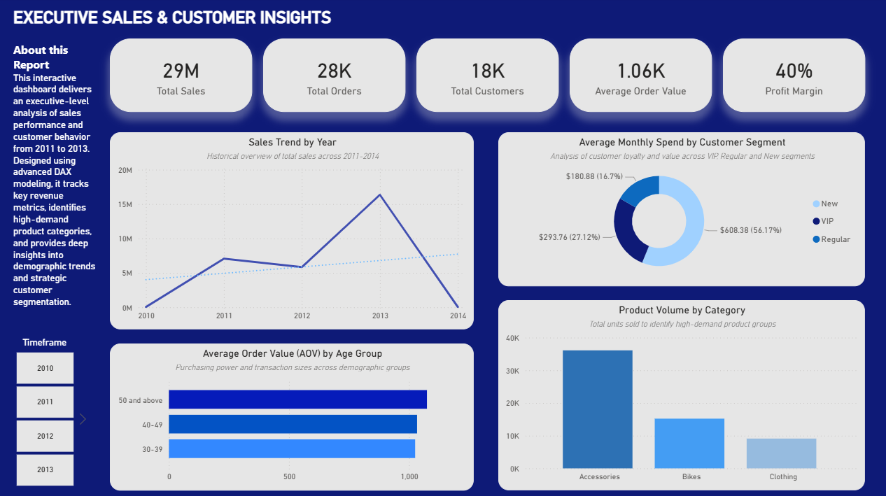

# Data Warehouse Analytics: Model Extension & Advanced Business Insights

## 📌 Project Overview
This project focuses on expanding an existing corporate Data Warehouse and developing a sophisticated analytical suite to drive executive business decisions. Working within a pre-existing environment, I designed and optimized a structured database pipeline — moving from initial infrastructure setup to advanced data quality scrubbing, star-schema modeling, and dynamic business intelligence reporting.

Using this newly structured layer, I first engineered a series of advanced analytical SQL scripts covering customer segmentation, cumulative trends, and ranking models. To complete the end-to-end analytical pipeline, I seamlessly transitioned these processed Gold-tier business tables into Power BI, designing an interactive **Executive Sales & Customer Insights Dashboard**. This dual-phase approach bridges back-end database engineering with front-end corporate storytelling to uncover deep insights into customer lifetime value (LTV), profitability, and product lifecycles.

---

## 📊 Executive Dashboard Preview
> *Below is a snapshot of the production-ready Power BI executive suite. The interface utilizes a tailored corporate palette (navy, blue, and grey) optimized for C-level readability and fast strategic data exploration.*




---

## 🏗️ My Contributions & Data Modeling

My core responsibilities spanned data infrastructure setup, database modeling, transformation, advanced analytics engineering, and data visualization:

### 1. Database Setup & Schema Extension (DDL & ELT)
* Initialized schemas representing operational and analytics tiers to support scalable data loading.
* Designed and deployed clean **Star Schema** components (`gold_dim_customers`, `gold_dim_products`, `gold_fact_sales`) using MySQL.
* Established data integration rules to merge conflicting operational attributes (e.g., combining distinct string fields like first and last names into consolidated master records).

### 2. Data Quality Assurance
* Handled database-specific anomalies, gracefully bypassing strict mode constraints to transform invalid `0000-00-00` and broken historical dates into proper, safe `NULL` values.
* Designed robust quality checks to validate primary key uniqueness, track inconsistent column lengths, and ensure strict referential integrity by detecting orphan records across foreign references.

### 3. Analytics & Segmentation Engineering (SQL & Power BI)
* Developed complex logic to safely calculate advanced KPIs like Recency, Lifespan, Average Order Value (AOV), and Average Order Revenue (AOR) while natively shielding calculations from division-by-zero errors.
* Implemented high-impact business tiering models to classify products by revenue performance and segment customer accounts into actionable behavioral cohorts (**VIP, Regular, New**).
* Translated database views into active Business Intelligence layers, using advanced DAX expressions in Power BI to track customer run-rates, lifecycle maturity, and simulated profit margins.

---

## 💎 Business Intelligence & DAX Engineering
To expand the static SQL tables into a dynamic reporting asset, custom business logic was injected directly into the Power BI semantic model. The DAX architecture focuses on four major areas:
* **Dynamic Customer Segmentation:** Automated classification of the 18K+ customer base into targeted loyalty cohorts based on automated lifecycle tenure and gross spending thresholds.
* **Customer Lifespan Tracking:** Advanced computation of account lifecycle maturity in months by cross-referencing relational transaction dates across fact tables.
* **Customer Value Normalization:** Normalizing fluctuating transaction histories to establish a true monthly run-rate spend per customer group.
* **Profit Margin Simulation:** Modeling a critical executive profitability KPI based on commercial margin management standards to unlock immediate financial benchmarking.

---

## 🎯 Key Business Insights Delivered
By diversifying the visual metrics beyond standard revenue counters, the dashboard uncovers critical cross-departmental answers:
* **Financial Trends (`Sales Trend by Year`):** Provides an immediate historical overview of macro revenue performance and trajectories across fiscal periods (2010–2014) to monitor growth stability.
* **Logistics & Inventory (`Product Volume by Category`):** Shifts focus from dollars to physical units, identifying which category dominates warehouse throughput (e.g., *Accessories* vs. *Bikes*) for optimal stock management.
* **Account Health (`Average Monthly Spend by Customer Segment`):** Verifies the true monetization value of loyalty tiers, proving the monthly run-rate value and commercial impact of the VIP pipeline.
* **Demographic Power (`AOV by Age Group`):** Unveils transactional purchasing power, pinpointing which age groups maintain the highest single-basket ticket sizes (*Average Order Value*) to optimize targeted marketing campaigns.

---

## 📂 Repository Structure

```text
├── 1_data_setup/
│   ├── create_gold_tables.sql       # DDL scripts for the new Star Schema components
│   ├── load_gold_layer.sql          # Bulk ingestion logic & master data file integration
│   ├── gold_dim_customers.csv       # Cleaned customer dataset exported for Power BI modeling
│   ├── gold_dim_products.csv        # Cleaned product dataset exported for Power BI modeling
│   └── gold_fact_sales.csv          # Cleaned transactional sales records for Power BI analytics
│
├── 2_ad_hoc_analytics/
│   ├── 1_exploration_measures.sql   # Core KPIs, descriptive statistics & base data profiling
│   ├── 2_magnitude_analysis.sql     # Volume-based metrics & high-impact revenue drivers
│   ├── 3_ranking_analysis.sql       # Top/bottom performance tracking, sales velocity & tiering
│   ├── 4_change_over_time.sql       # Temporal trends, running totals & Month-over-Month growth
│   └── 5_data_segmentation.sql      # Value-based customer tiering & cost range classification
│
└── 3_analytical_reporting/
    ├── 1_customer_report.sql        # Production View: Consolidated master customer LTV report
    ├── 2_product_report.sql         # Production View: Consolidated product lifecycle report
    ├── Executive_Sales_Dashboard.pbix # Production BI Model & interactive semantic layers
    └── dashboard_preview.png        # Executive Dashboard visual screenshot for documentationr customer lifetime value (LTV) report
   
